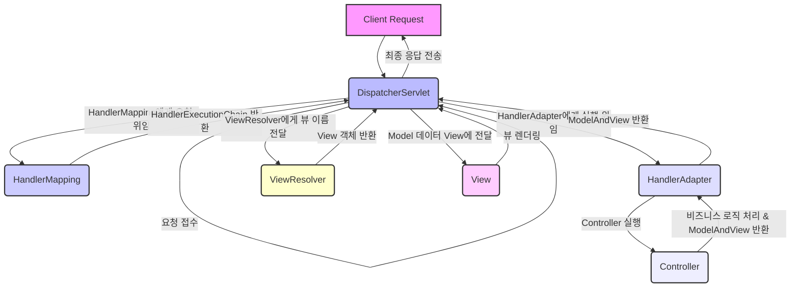

# Spring MVC 요청 처리 흐름 (DispatcherServlet부터 View Resolver까지) 스터디

## 1. 서론

Spring MVC는 자바 기반 웹 애플리케이션 개발에 광범위하게 활용되는 웹 프레임워크. 
본 프레임워크는 Model-View-Controller(MVC) 디자인 패턴에 기반을 두어, 웹 요청의 효율적인 처리 및 응답 생성을 위한 구조를 제공.
특히, `DispatcherServlet`을 중심으로 하는 요청 처리 흐름에 대한 심층적인 이해는 Spring MVC의 핵심적인 부분

## 2. 주요 구성 요소

* **`DispatcherServlet`**: Spring MVC의 가장 핵심적인 프론트 컨트롤러(Front Controller). 모든 웹 요청을 최우선적으로 수신하여 적절한 핸들러(Controller)로 라우팅하며, 응답 생성의 전반적인 과정을 조율.

  **[예시: web.xml 설정]**
    ```xml
    <web-app>
        <servlet>
            <servlet-name>dispatcher</servlet-name>
            <servlet-class>org.springframework.web.servlet.DispatcherServlet</servlet-class>
            <init-param>
                <param-name>contextConfigLocation</param-name>
                <param-value>/WEB-INF/spring/appServlet/servlet-context.xml</param-value>
            </init-param>
            <load-on-startup>1</load-on-startup>
        </servlet>
        <servlet-mapping>
            <servlet-name>dispatcher</servlet-name>
            <url-pattern>/</url-pattern>
        </servlet-mapping>
    </web-app>
    ```

* **`HandlerMapping`**: 요청 URL을 기반으로 해당 요청을 처리할 `Handler(Controller)`를 식별하고, `HandlerExecutionChain` (Handler 및 Interceptor 목록)을 `DispatcherServlet`에게 반환. 주로 `@RequestMapping`과 같은 어노테이션을 통해 암묵적으로 구성된다.

    (아래 `Controller` 예시의 `@GetMapping("/hello")`와 같은 어노테이션을 통해 특정 URL과 메서드를 매핑한다.)

* **`HandlerAdapter`**: 실질적인 핸들러 실행을 담당. 이는 다양한 유형의 핸들러(Controller)를 유연하게 처리할 수 있도록 추상화된 인터페이스를 제공. `DispatcherServlet`이 특정 `Controller`의 메서드를 호출할 수 있도록 중간에서 연결하는 역할을 수행한다.

    (개발자가 직접 구현하는 경우는 드물며, Spring 내부적으로 `RequestMappingHandlerAdapter` 등이 사용된다.)

* **`Controller` (Handler)**: 실제 비즈니스 로직을 수행하며, 요청 처리 후 `ModelAndView` 객체 또는 데이터를 반환. `ModelAndView`는 뷰의 논리적 이름과 뷰에 전달될 모델(데이터)을 포함하는 객체.

    **[예시: Controller 코드]**
    ```java
    import org.springframework.stereotype.Controller;
    import org.springframework.web.bind.annotation.GetMapping;
    import org.springframework.web.servlet.ModelAndView;

    @Controller
    public class MyController {

        @GetMapping("/hello")
        public ModelAndView helloWorld() {
            ModelAndView mav = new ModelAndView("hello"); // 뷰 이름 설정
            mav.addObject("message", "Hello, Spring MVC!"); // 모델 데이터 추가
            return mav;
        }

        @GetMapping("/api/data")
        public @ResponseBody String getData() {
            return "{\"value\": \"some data\"}"; // JSON 데이터 직접 반환 예시
        }
    }
    ```

* **`ModelAndView`**: `Controller`가 반환하는 객체로, 뷰의 논리적 이름과 뷰에 전달될 모델(데이터)을 포함하는 객체.

    **[예시: ModelAndView 객체 구성 (Controller 예시와 동일)]**
    ```java
    ModelAndView mav = new ModelAndView("hello"); // 뷰 이름: "hello"
    mav.addObject("message", "Hello, Spring MVC!"); // 모델 데이터: "message" -> "Hello, Spring MVC!"
    ```

* **`ViewResolver`**: `Controller`가 반환한 `ModelAndView`의 논리적 뷰 이름(예: "home", "userList")을 실제 뷰 객체(예: `/WEB-INF/views/home.jsp`)로 변환하는 역할을 수행.

    **[예시: ViewResolver 설정 (servlet-context.xml)]**
    ```xml
    <beans:bean class="org.springframework.web.servlet.view.InternalResourceViewResolver">
        <beans:property name="prefix" value="/WEB-INF/views/" />
        <beans:property name="suffix" value=".jsp" />
    </beans:bean>
    ```
    (위 설정 시, "hello"라는 뷰 이름은 `/WEB-INF/views/hello.jsp`로 해석된다.)

* **`View`**: `ViewResolver`에 의해 결정된 실제 뷰(JSP, Thymeleaf, FreeMarker, JSON 등)를 나타낸다. 제공된 모델 데이터를 활용하여 최종 응답 화면을 렌더링.

    **[예시: View (hello.jsp) 코드]**
    ```jsp
    <%@ page language="java" contentType="text/html; charset=UTF-8" pageEncoding="UTF-8"%>
    <!DOCTYPE html>
    <html>
    <head>
        <meta charset="UTF-8">
        <title>Spring MVC Example</title>
    </head>
    <body>
        <h1>${message}</h1> <%-- Controller에서 추가한 모델 데이터 'message' 사용 --%>
    </body>
    </html>
    ```

## 3. 요청 처리 흐름 단계별 설명

클라이언트의 웹 요청 발생 시, `DispatcherServlet`을 중심으로 다음과 같은 8단계의 처리 흐름이 진행.

### 단계 1: 요청 접수 (Request Reception)

* **클라이언트**는 웹 요청(HTTP Request)을 전송.

* 모든 요청은 웹 애플리케이션의 `web.xml` 또는 `@WebServlet` 설정에 의거하여 **`DispatcherServlet`**으로 전달. `DispatcherServlet`은 Spring MVC의 최전방에서 모든 요청을 수신하는 프론트 컨트롤러의 역할을 수행.

### 단계 2: 핸들러 매핑 (Handler Mapping)

* **`DispatcherServlet`**은 요청을 처리할 `Handler(Controller)`를 식별하기 위해 등록된 **`HandlerMapping`**들에게 요청 처리를 위임.

* `HandlerMapping`은 요청 URL(`@RequestMapping` 등)과 매핑되는 `Controller`를 탐색하여 `HandlerExecutionChain` (탐색된 `Controller` 및 적용될 `Interceptor` 목록)을 `DispatcherServlet`에게 반환.

### 단계 3: 핸들러 실행 (Handler Execution)

* **`DispatcherServlet`**은 `HandlerMapping`으로부터 전달받은 `HandlerExecutionChain` 내에서 `Controller`를 실행할 수 있는 **`HandlerAdapter`**를 탐색.

* 적절한 `HandlerAdapter`가 식별되면, `HandlerAdapter`는 `Controller`의 메서드를 호출함으로써 실질적인 요청 처리를 유도.

### 단계 4: 비즈니스 로직 처리 (Business Logic Processing)

* **`Controller`**는 `HandlerAdapter`에 의해 호출되어 요청을 처리.

* 해당 단계에서 `Controller`는 필수적인 비즈니스 로직을 수행하며, 데이터베이스 조회 또는 업데이트와 같은 작업을 서비스 계층(Service Layer)에 위임.

* 처리 결과로 **`ModelAndView`** 객체(뷰 이름 및 모델 데이터 포함) 또는 직접 응답을 위한 데이터(예: `@ResponseBody`를 활용한 JSON/XML)를 반환.

### 단계 5: 뷰 이름 결정 (View Name Resolution)

* **`Controller`**가 `ModelAndView`를 반환할 시, **`DispatcherServlet`**은 `ModelAndView` 내의 논리적 뷰 이름(예: "userList")을 실제 뷰 객체로 변환하고자 등록된 **`ViewResolver`**들에게 요청 처리를 위임.

* `ViewResolver`는 논리적 뷰 이름을 기반으로 실제 뷰 리소스(예: `/WEB-INF/views/userList.jsp`)를 탐색하여 **`View`** 객체를 반환.

### 단계 6: 모델 데이터 전달 (Model Data Transfer)

* **`DispatcherServlet`**은 `Controller`가 반환한 `ModelAndView`의 모델 데이터를 `View` 객체에 전달.

### 단계 7: 뷰 렌더링 (View Rendering)

* **`View`** 객체는 전달받은 모델 데이터를 활용하여 최종적으로 클라이언트에게 제공될 응답 화면(HTML, JSON 등)을 렌더링. (예: JSP 파일의 컴파일을 통한 HTML 변환)

### 단계 8: 응답 전송 (Response Dispatch)

* **`DispatcherServlet`**은 `View`가 렌더링한 최종 응답(HTML, JSON 등)을 **클라이언트**에게 전송.

## 4. 요청 처리 흐름 도표



```
클라이언트 요청
      |
      V
+-------------------+
| DispatcherServlet |  (Front Controller)
+-------------------+
      |  1. 요청 접수
      |
      V
+-------------------+
|   HandlerMapping  |  (요청 URL에 맞는 Controller 찾기)
+-------------------+
      |  2. HandlerExecutionChain 반환 (Controller + Interceptors)
      |
      V
+-------------------+
|   HandlerAdapter  |  (찾은 Controller 실행)
+-------------------+
      |  3. Controller 실행 요청
      |
      V
+-------------------+
|     Controller    |  (비즈니스 로직 처리, ModelAndView 반환)
+-------------------+
      |  4. ModelAndView 반환 (논리적 뷰 이름 + 모델 데이터)
      |
      V
+-------------------+
|   ViewResolver    |  (논리적 뷰 이름을 실제 View 객체로 변환)
+-------------------+
      |  5. View 객체 반환
      |
      V
+-------------------+
|       View        |  (모델 데이터를 사용하여 최종 화면 렌더링)
+-------------------+
      |  6. 렌더링된 응답 반환
      |
      V
+-------------------+
| DispatcherServlet |  (최종 응답 클라이언트에 전송)
+-------------------+
      |
      V
클라이언트 응답
```
